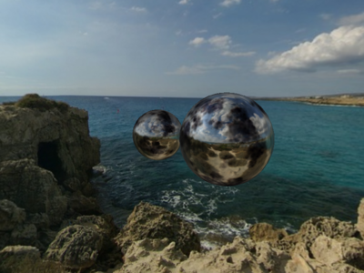

This example demonstrates usage of cube map textures and different texture
layers for simulation of open world with two tarnish reflective spheres in
front of the camera. This example also demonstrates usage of scene graph,
resource manager and pre-made primitives.

Usage
-----

The application tries to load cube map texture from directory in which it is
run. Cube map texture consists of six JEPG files `+x.jpg`, `-x.jpg`, `+y.jpg`,
`-y.jpg`, `+z.jpg` and `-z.jpg`, each representing one side of the cube. Note
that all images must be turned upside down (+Y is top):

              +----+
              | -Y |
    +----+----+----+----+
    | -Z | -X | +Z | +X |
    +----+----+----+----+
              | +Y |
              +----+

You can also pass file path prefix to the application as parameter, for
example

    ./cubemap ~/images/city

The application will then load `~/images/city+x.jpg`, `~/images/city-x.jpg`
etc. as cube map texture.

Key shortcuts
-------------

**Arrow keys** *rotate* the camera around the spheres. It is not possible, due
to nature of the cube map texture, to *move* around the scene.

Documentation
-------------

This example is thoroughly explained in the documentation, which you can read
also online at http://mosra.cz/blog/magnum-doc/examples-cubemap.html .

Image Source
------------

The cube map images are work of Emil Persson, aka Humus, http://www.humus.name.
The images are licensed under a Creative Commons Attribution 3.0 Unported
License, http://creativecommons.org/licenses/by/3.0/.
